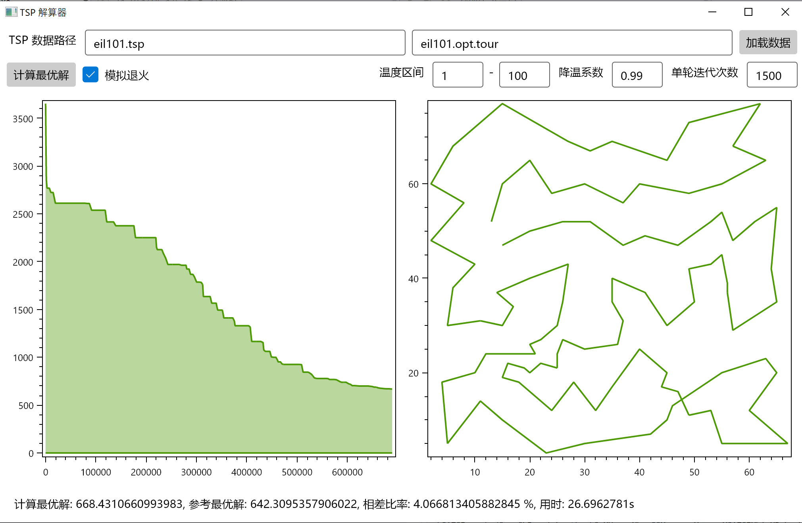

# Simulated Annealing Enabled TSP Solver

Artificial Intelligence Course Project

Enze He, Sun Yat-sen University 

## Environment
Prerequisties: .NET 5 SDK
SDK Download: https://dotnet.microsoft.com/download/dotnet/5.0

System: Windows/Linux/macOS

## Build
Windows: build.bat
Linux/macOS: ./build.sh

## Run (with Graphic User Interface):
Windows: SATSP.exe
Linux/macOS: ./SATSP

## UI

